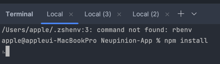
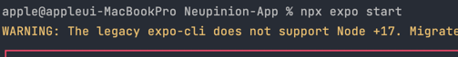
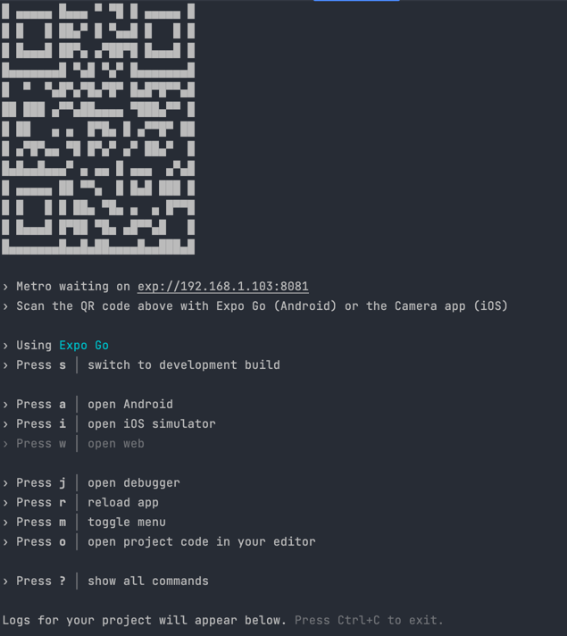
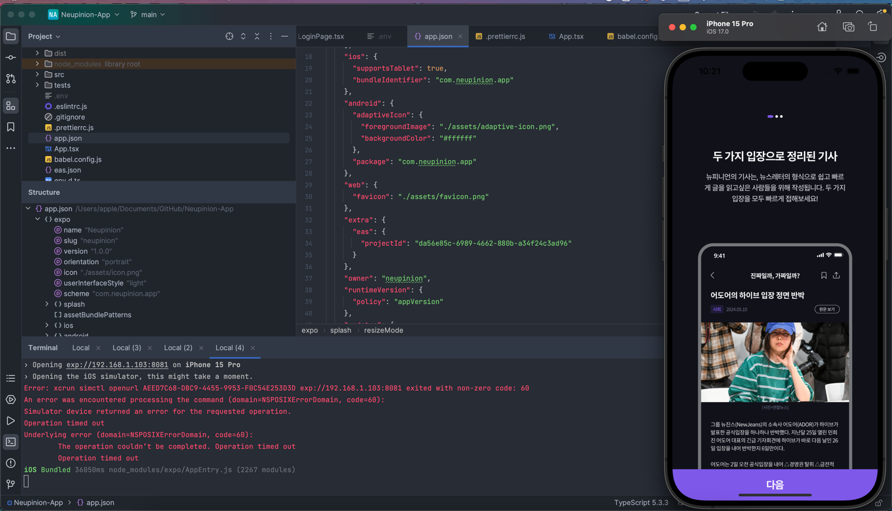

# Neupinion-App 캡스톤디자인 실행 메뉴얼

- 개발 IDE는 Jetbrain의 WebStrom으로 개발되었기 때문에, 실행 또한 WebStorm으로 진행하시는 것을 추천드립니다.
- 비용이나, 기기 문제로 WebStorm을 사용할 수 없다면, VSCode를 같은 방식으로 사용할 수 있으나, 메뉴얼은 WebStorm을 기준으로 작성하도록 하겠습니다.

## Git Clone 혹은, Fork

- 사용자 컴퓨터에서 다음의 링크로부터, 어플리케이션을  Clone 혹은 Fork후, IDE에서 오픈합니다.
  https://github.com/Neupinion/Neupinion-App

## 관련 패키지 설치

###  Node.js
- https://nodejs.org/en
- npm 명령어 실행을 위해서, PC에 Node.js가 설치가 필수입니다.

### Expo CLI
- expo cli로 개발이 되었기 때문에 다음과 같이 PC에  Expo Cli를 전역으로 설치해야합니다.
```bash
npm install -g expo-cli
```

### Git
- PC에 git 설치를 권장합니다.

- IDE의 하단 터미널에서, npm install 명령어를 입력 후, 관련 패키지가 설치된 후, 다음 단계로 진행합니다.


# 에뮬레이터 설치

- 윈도우 및  맥에서 실행되는 어플리케이션이 아니기 때문에, 실제 에뮬레이터를 설치하여 테스트를 할 수 있도록 메뉴얼을 작성하였습니다.
- ios 환경을 기반으로 개발하였으나, ios는 Mac이 아니라면 시행할 수 없기 때문에, Android환경 관련한 메뉴얼 또한 작성하였습니다.

### Android (Mac && Window)
- https://docs.expo.dev/workflow/android-studio-emulator/
- 위 링크의 메뉴얼을 따라서, 에뮬레이터를 정상적으로 작동시키는 과정을 참고하여 에뮬레이터 설치를 진행해주시길 바랍니다.

### ios (Mac)
- https://docs.expo.dev/workflow/ios-simulator/
- 해당 링크의 메뉴얼을 따라서, Xcode 설치 및 에뮬레이터 설치 및 설정을 진행해주시길 바랍니다.

## 환경 변수 파일 추가
- github security를 Application 레포지터리에는 적용하지 않았기 때문에, 보안 주요사항이 작성되어있는 .env파일을 Neupinion-App의 root 경로에 추가해야합니다.


## 실행 방법

```bash
npx expo start
```
해당 명령어를 터미널에 입력 후, 터미널에서 설치가 권장되는 부분이 있다면 설치를 진행합니다.



- 해당 화면에 진입하였다면, 터미널에 a를 누르면 설치한 android emulator가 시행되며, i를 누르면 설치한 ios emulator가 시행됩니다.


- 에뮬레이터에, Expo Go 라는 어플리케이션을 다운로드 받아야한다는 안내문이 나온다면 다운로드를 진행해주시길 바랍니다. 설치 후, 어플이 시행안된다면 해당 터미널을 종료 후, 다른 터미널에서 어플을 재시작하시길 바랍니다.



- 번들링이 성공하고, 소스코드를 모두 화면으로 변환이 성공된다면, 에뮬레이터에서 성공적으로 어플리케이션을 시행할 수 있습니다.

## 문제 발생시

- dmstjdhdh@cau.ac.kr 혹은 kyw08002@gmail.com으로 연락주시거나, 슬랙으로 연락해주시면 대응하도록 하겠습니다.
- 'Expo Cli 환경에서 어플리케이션 실행 방법'이 문제 해결에 도움이 될 수 있는 검색키워드가 될 것 같습니다.
